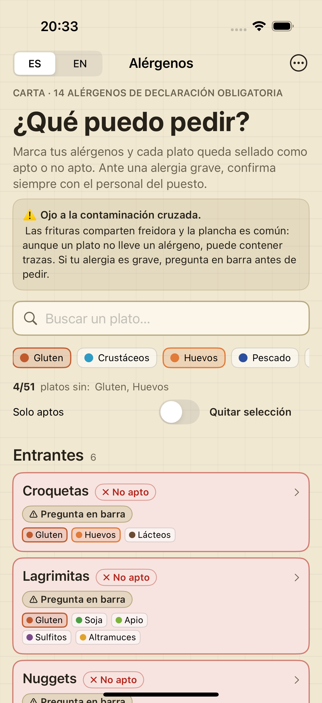
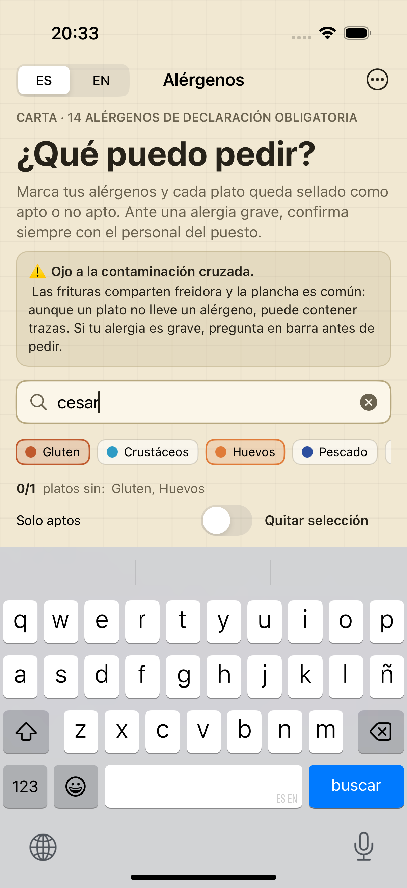
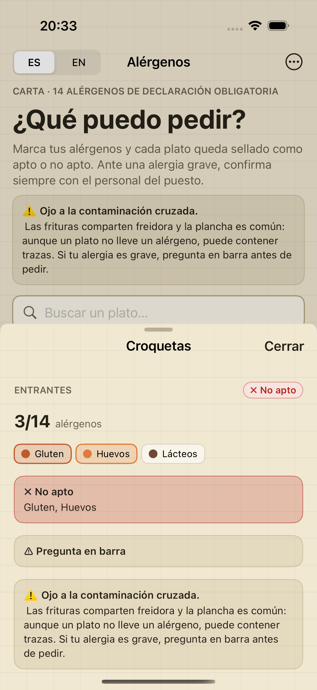
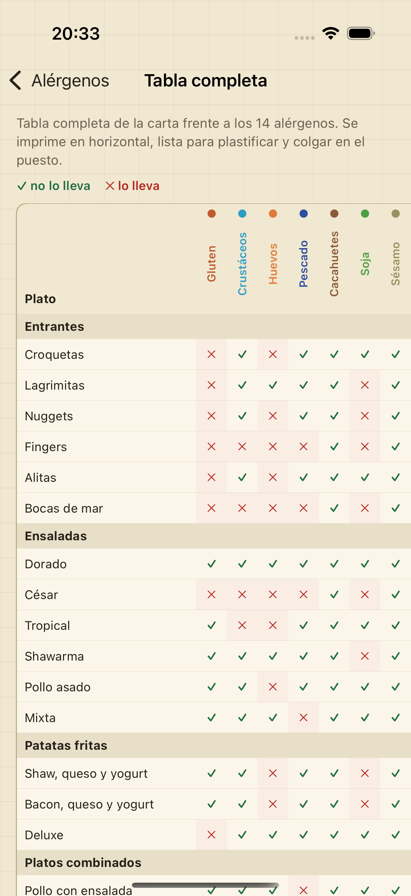
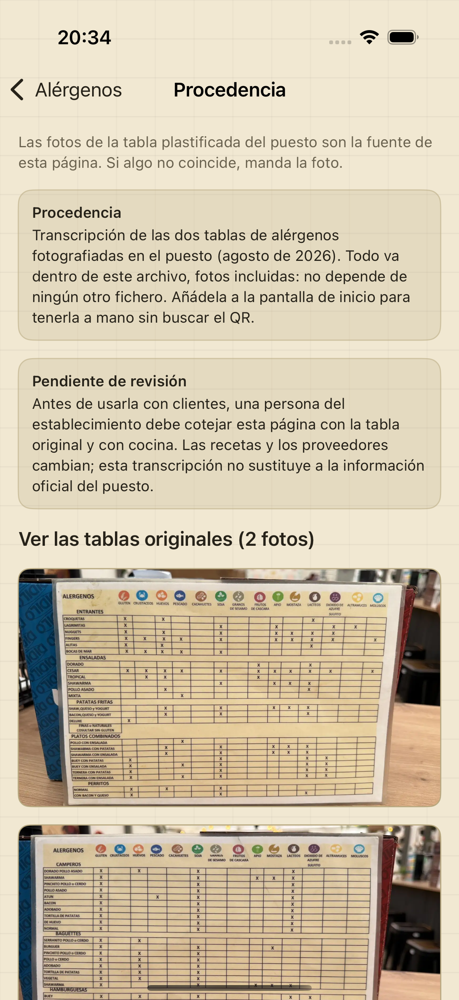
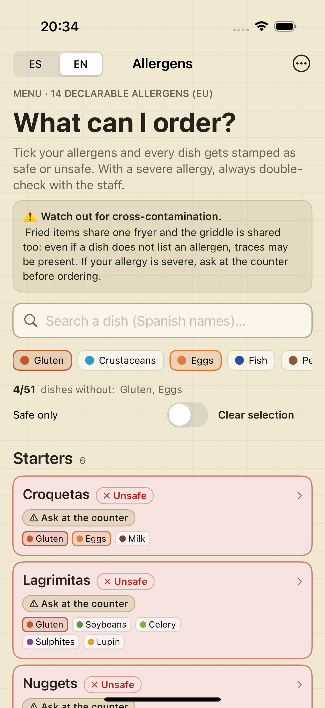

# Alérgenos El Dorado — app iOS

App nativa en **SwiftUI** con la tabla de alérgenos de la carta del Restaurante
El Dorado. Funciona **sin conexión**, en **español e inglés**, y no lleva ni un
dato escrito a mano: todo sale de la carta original del puesto por script.

Sin dependencias de terceros. Cero red en tiempo de ejecución.

| Carta y sellos | Búsqueda | Detalle del plato |
|---|---|---|
|  |  |  |

| Tabla completa | Procedencia y fotos | En inglés |
|---|---|---|
|  |  |  |

Las 12 capturas están en [`Capturas/`](Capturas/) y **no son maquetas**: las
saca la propia batería de pruebas de interfaz del simulador
(`node tools/capturas.mjs`), así que son el estado real de la app.

## Qué hace

- **La carta frente a tus alérgenos**: marcas los tuyos (los 14 de declaración
  obligatoria) y cada plato queda sellado como **✓ Apto** o **✗ No apto**.
  Sin nada marcado no se sella nada: no se promete seguridad que no se sabe.
- **Buscador** por nombre de plato o de sección, sin acentos y sin mayúsculas.
- **Filtro «solo aptos»** y contador de platos que puedes pedir.
- **Mis alérgenos**: tu selección y el idioma se guardan entre lanzamientos.
- **Ficha de cada plato** con sus alérgenos, su sección y su nota.
- **Tabla completa** (51 platos × 14 alérgenos) y **leyenda** de colores.
- **Avisos que no se esconden**: contaminación cruzada, «⚠ Pregunta en barra» en
  los platos cuya fritura o plancha es compartida, y los avisos de procedencia y
  revisión pendiente de la tabla original.
- **Las dos fotos de la tabla plastificada** del puesto, dentro de la app.

## Requisitos

- iOS **17.0** o superior (iPhone).
- Xcode con la **plataforma de iOS instalada**. Ojo: un Xcode sin ella abre el
  proyecto y muestra el código, pero no compila
  (`iOS 26.2 is not installed`). Si te pasa, comprueba en
  Xcode → Settings → Components, o usa un Xcode que tenga la plataforma.
- [XcodeGen](https://github.com/yonaskolb/XcodeGen) (`brew install xcodegen`):
  el `.xcodeproj` se genera desde `project.yml`, no se edita a mano.
- Node 18+ solo para los scripts de datos.

## Cómo se construye y se comprueba

```bash
# 1. Proyecto Xcode (se genera; no se versiona)
xcodegen generate

# 2. Compilar y arrancar en el simulador
xcodebuild -project Alergenos.xcodeproj -scheme Alergenos \
  -destination 'platform=iOS Simulator,name=iPhone 16' \
  -derivedDataPath build build

# 3. Pruebas: 30 unitarias + 7 de interfaz (pulsan la app de verdad)
xcodebuild -project Alergenos.xcodeproj -scheme Alergenos \
  -destination 'platform=iOS Simulator,name=iPhone 16' \
  -derivedDataPath build -resultBundlePath build/alergenos.xcresult test

# 4. Capturas de las pruebas, con nombres legibles
node tools/capturas.mjs
```

O simplemente abre `Alergenos.xcodeproj` en Xcode y dale a ▶︎.

## Los datos: de dónde salen

**La carta original (`alergenos.html`) no está en este repositorio**: es la web
del restaurante y se mantiene aparte. Los datos ya vienen generados en
`Alergenos/Resources/` (`platos.json`, `i18n.json` y las dos fotos), así que la
app compila y funciona sin ella. Para **regenerarlos** tras un cambio en la
carta:

```bash
# indicando la ruta del HTML...
node tools/extract.mjs /ruta/a/alergenos.html
node tools/verify.mjs  /ruta/a/alergenos.html

# ...o dejándolo en fuente/alergenos.html, o al lado del proyecto
node tools/extract.mjs && node tools/verify.mjs
```

- `tools/extract.mjs` lee los literales del HTML con un parser propio (sin
  `eval`) y escribe el JSON y las fotos. **Falla si los conteos no cuadran**
  (14 alérgenos / 9 secciones / 51 platos / 8 avisos) y si a un texto le falta
  su traducción.
- `tools/verify.mjs` lo comprueba **por un método distinto** (expresiones
  regulares sobre el texto crudo): compara las **714 celdas** de la matriz
  plato × alérgeno, los 21 textos de cada idioma, las notas, los avisos y las
  fotos byte a byte. Hoy: **0 diferencias**.

## Cómo está organizado

```
Alergenos/
  App/       AlergenosApp.swift      punto de entrada
  Modelo/    Datos.swift             modelo + JSON que viene del HTML
             Aptitud.swift           reglas puras (apto/no apto, búsqueda)
             Carga.swift             lectura del bundle y preferencias
             Idioma.swift            ES/EN y claves de texto
             TextosApp.swift         los únicos textos escritos a mano
  Vista/     CartaView.swift         pantalla principal
             FilaPlatoView.swift     fila con sello y alérgenos
             DetallePlatoView.swift  ficha del plato
             MisAlergenosView.swift  selección persistida
             LeyendaView.swift       qué es cada color y cada sello
             TablaView.swift         la tabla completa
             ProcedenciaView.swift   avisos y fotos originales
             EstadoApp.swift         estado y persistencia
             Estilo.swift            colores del CSS original
             FondoCuadricula.swift   el papel rayado de la tabla
AlergenosTests/     30 pruebas de lógica y datos
AlergenosUITests/   7 pruebas que pulsan la app y dejan capturas
tools/              scripts de datos, verificación, icono y capturas
```

`Package.swift` **no forma parte del build de la app**: existe para que los
analizadores de Swift tengan un contexto de módulo del que sacar los tipos
(declara solo `Alergenos/Modelo`, que es Foundation puro).

## Diferencias deliberadas con la web

- **Sin nada marcado, no se sella nada.** La web pinta «✓ Apto» en todos los
  platos cuando no has marcado tus alérgenos. Aquí no: decir «apto» sin saber
  qué le pasa a quien lo lee es engañoso.
- **Pantallas nuevas** («Mis alérgenos», leyenda, tabla, procedencia). Sus
  rótulos son los únicos textos escritos a mano, aislados en `TextosApp.swift`.
- **No incluido a propósito:** lector de QR/cámara, firma y TestFlight,
  impresión/PDF nativa, iPad/macOS, modo oscuro (la web es de papel claro y la
  app respeta ese aspecto) y cualquier dependencia externa.

## Instalarlo en un iPhone

El proyecto se genera con `project.yml`, así que los cambios van al YAML:

```yaml
# project.yml → targets → Alergenos → settings → base
DEVELOPMENT_TEAM: "ABCDE12345"   # tu Team ID (Xcode → Settings → Accounts)
CODE_SIGNING_ALLOWED: "YES"
CODE_SIGNING_REQUIRED: "YES"
```

Luego `xcodegen generate` y ▶︎ con el teléfono conectado. Para TestFlight o App
Store hace falta cuenta de desarrollador (99 €/año) y subir un Archive.

## Aviso importante sobre los datos

Esta app **transcribe** la tabla del establecimiento: no es una fuente oficial
ni sustituye a la información del puesto. Antes de usarla con clientes, una
persona del establecimiento debe cotejarla con la tabla original y con cocina
(las recetas y los proveedores cambian), tal como recuerda el propio aviso de
«Pendiente de revisión» dentro de la app. La responsabilidad legal de la
información de alérgenos es del establecimiento (Reglamento UE 1169/2011).

Detalle detectado que conviene revisar: la tabla declara 14 alérgenos pero
**ningún plato tiene marcado sésamo**. No es un fallo de la app —el verificador
reproduce el HTML celda a celda— pero es de las cosas que hay que confirmar con
la tabla en la mano.
